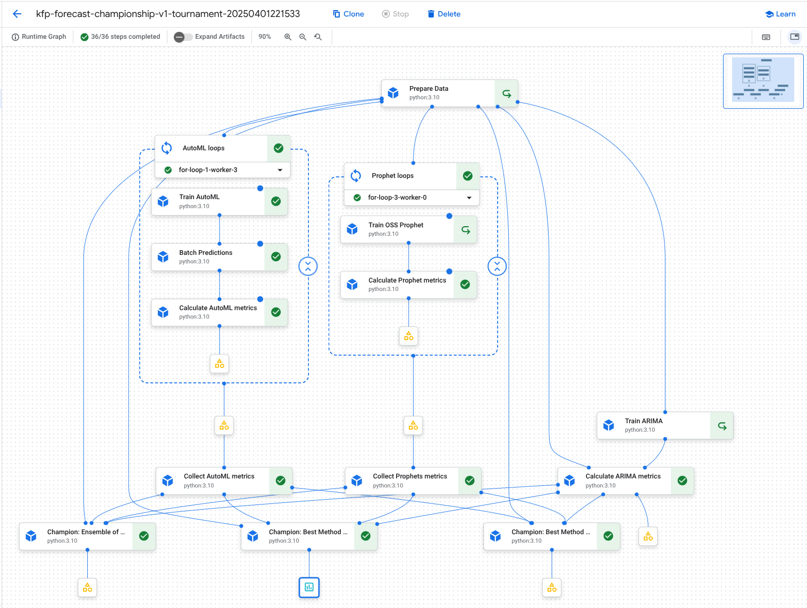

# vertex-forecast-poc
assets needed to successfully pilot Vertex Forecast for enterprise demand forecasting use cases

## Getting Started

First, edit [env_config.py](env_config.py)

<details>
    <summary> <strong>environment setup with Poetry</strong></summary>

1. Create new conda environment
    
```bash
export ENV_NAME=py310_vf_v1
export ENV_DISPLAY=py310_vf_v1

conda create -n $ENV_NAME -y python=3.10.16
conda activate $ENV_NAME

conda install pip
pip install -U poetry ipykernel packaging
```

2. Install the required Python packages using Poetry:
    
```bash
poetry install
```

3. Add conda kernel for Wokbench Instance notebook
    
```bash
DL_ANACONDA_ENV_HOME="${DL_ANACONDA_HOME}/envs/$ENV_NAME"
echo $DL_ANACONDA_ENV_HOME

python -m ipykernel install --prefix "${DL_ANACONDA_ENV_HOME}" --name $ENV_NAME --display-name $ENV_DISPLAY
```

4. After reloading the Workbench instance (`ctrl + r`), you should see `$ENV_DISPLAY` available as a notebook kernel

</details>

<details>
    <summary> <strong>Vertex Forecast parameters</strong></summary>

> see [Training parameters for forecast models](https://cloud.google.com/vertex-ai/docs/tabular-data/forecasting-parameters)

* `TARGET_COLUMN`: The demand measurment. In our case it is the number of trips taken per day from a particular bike station - the sum of trips for a day.
* `TIME_COLUMN`: The time of demand. Expressed in the time or date units related to the granularity of the forecast exercise. In our case, demand is measured daily so the time column is prepared as a date.
* `SERIES_COLUMN` groups rows associated with the same time series
* `SPLITS_COLUMN` groups sequential rows within each time series for their purpose during the forecasting exercise
* `COVARIATE_COLUMNS` is a list of columns that measure additional features over time. Some forcasting methods can use these to imporove the understanding of trends and make better forecasts.To use a covariate for forecasting then its value needs to be know in advance to be used when making predictions, or the forecast method will need to have special handling for unknown covariates. The three types of covariate information are:
  * **Attributes**
    * Values that do not change over time but describe what the time series represents. In our case a bike station might be identified by latitude and longitude, color, number of bike slots.
  * **Covariates that are available (known) at forecast time (in advance)**
     * These are measurements that can be known ahead of time like when holidays occur, promotions, events, changes in capacity.
  * **Covariates that are unavailable (unknown) at forecast time (in advance)**
     * Measurements that change over time but are not known until the time of measurment like rain, other weather, foot traffic, and queue length. 

`FORECAST_GRANULARITY` is the frequency of measurment like `MINUTE`, `HOUR`, `DAY`, `WEEK`, `MONTH`, `YEAR`
* The data was summarized at the DAY level in the data preparation notebook
* This is the amount of time between measurments - rows
* For a different granularity, you may need to summarize the demand signal as a `SUM`, `MIN`, `MAX`, or `AVERAGE` for different time components.

`FORECAST_TEST_LENGTH`  is the number of rows allocated to the test region
* This is in the units of `FORECAST_GRANULARITY`
* The data preparation included setting this for specifying the `SPLITS_COLUMN = 'TEST'` values for each time series in `SERIES_COLUMMN`

`FORCAST_VALIDATE_LENGTH` is the number of rows allocated to the validation region
* This is in the units of `FORECAST_GRANULARITY`.
* The data preparation included setting this for specifying the `SPLITS_COLUMN = 'VALIDATE'` values for each time series in `SERIES_COLUMN`

`FORECAST_HORIZON_LENGTH` is the number of rows to forecast into the future beyond the test region
* This is in the units of `FORECAST_GRANULARITY`
* This needs to be set as an input to the forecast method
</details>

### Multicontender vs Champion pipeline



see [02_vf_pipelines.ipynb](notebooks/02_vf_pipelines.ipynb) to create pipeline